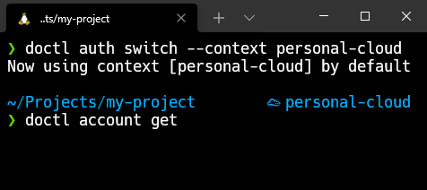

<p align="center">
    
</p>

# Powerlevel10k addons

This is a collection of custom segments for [powerlevel10k](https://github.com/romkatv/powerlevel10k).

## List of the segments and their options

- [doctl](https://github.com/digitalocean/doctl) - The official command line interface for the DigitalOcean API 
  - **POWERLEVEL9K_DOCTL_HIDE_DEFAULT** (default: true)
    - Type: boolean
    - Description: Don't show segment when switched to the default context

## Installation

### Clone this repository somewhere on your machine

```zsh
# Clone the repostiroy to the home directory
git clone https://github.com/lexuzieel/p10k-addons.git ~/.p10k-addons
```

### Update your `.zshrc` file

```zsh
# .zshrc

# To customize prompt, run `p10k configure` or edit ~/.p10k.zsh.
[[ ! -f ~/.p10k.zsh ]] || source ~/.p10k.zsh

# Load p10k prompt addons
source ~/.p10k-addons/addons/*.zsh
```

## Usage

After sourcing addons you can add new prompt elements:

```zsh
typeset -g POWERLEVEL9K_RIGHT_PROMPT_ELEMENTS=(
    ... doctl
)
```

## Upgrading

To update the addons to the latest version, pull latest changes into the local repository:

```zsh
git -C ~/.p10k-addons pull
```
